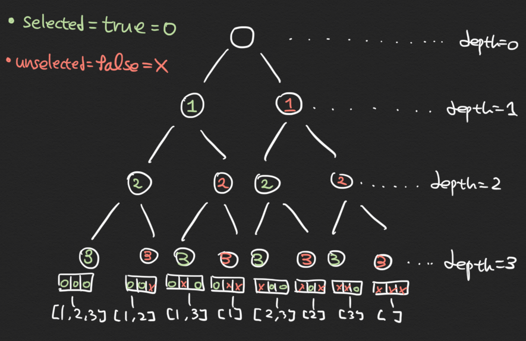
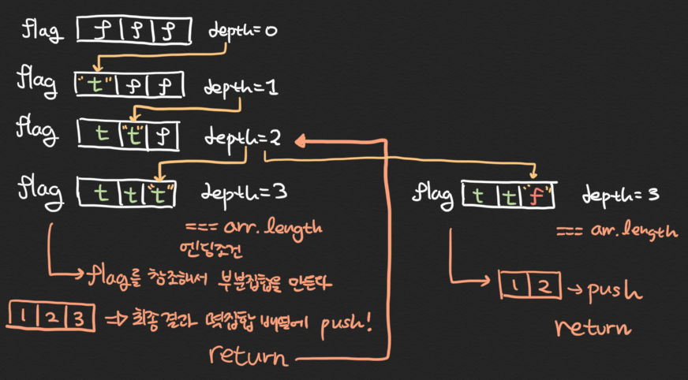

# JavaScript로 멱집합(PowerSet) 리턴하는 함수 구현하기 
## 완전탐색 알고리즘을 위한 준비, DFS

# 멱집합(PowerSet)?
한자어 이기 때문에 쉽게 다가오진 않지만, 정의에 따르면 **주어진 집합의 모든 부분집합의 집합** 이라고 한다.
국어사전의 정의도 무슨 말인지 잘 모르겠다(?). 예를 접해보는게 가장 빠르고 쉬운길이다.
```
[1, 2, 3] 이란 배열이 주어진 집합이라고 할 때,
[1, 2, 3] 의 모든 부분집합은 아래 8개와 같다.

[] (공집합)
[1] [2] [3]
[1, 2] [1, 3] [2, 3]
[1, 2, 3]

따라서 멱집합은 위의 모든 부분집합들의 집합이므로
[ [], [1], [2], [3],  [1, 2], [1, 3], [2, 3], [1, 2, 3] ]
처럼 2차원 배열로 표현될 수 있다.
```

즉, 멱집합을 구하는 함수는 다음과 같이 정의 될 수 있다.
- 함수의 인자: 주어진 집합(배열)
- 함수안의 로직: 주어진 집합에 대한 부분집합을 구하기
- 함수의 리턴값: 멱집합(부분집합들의 집합 === 2차원 배열)

# 돌파구
먼저 우리가 부분집합을 구하는 과정을 살펴보자.
```
[1, 2, 3] 
0. 우선 공집합 추가하고
1. 하나씩 뽑고 [1] [2] [3]
2. 두개씩 뽑고 [1, 2] [1, 3] [2, 3]
3. 세개 뽑자 [1, 2, 3]
```
보니까 점점 0층부터 3층까지 층을 늘려나가면서 부분집합을 구하는 것을 볼 수 있다. 즉, 층에 따라서 어떤 숫자를 뽑을지 우리의 뇌는 계산한다. **층**은 Depth First Search와 관련이 있다.
다만 컴퓨터에게 주어지는 코드 에서는 정확하게 어떤 숫자를 뽑을지 명시가 필요하다. 예를들어 우리가 `[1, 2]`를 뽑고나서 `[1, 3]`을 바로 뽑을 수 있는 이유는 우리의 뇌는 이미 2를 사용한것을 알고있다. (상태에 대한 정보가 뇌에 저장되어있음)
하지만, 컴퓨터는 코드로 명령을 내려주지 않으면 어떤것이 사용되었고 어떤 것이 사용되지 않았는지에 대한 상태를 모른다.

즉 컴퓨터에는 다음과 같은 명시가 필요한 셈이다.
```
[O, O, O] => [1, 2, 3]
[O, O, X] => [1, 2]
[O, X, O] => [1, 3]
[O, X, X] => [1]
[X, O, O] => [2, 3]
[X, O, X] => [2]
[X, X, O] => [3]
[X, X, X] => []
```
명시된 **배열의 상태**에 따라서 부분집합이 달라지는 것을 볼 수 있다. 그럼 층에따라서 배열의 상태를 달리 해 주면 되지 않을까? => DFS 알고리즘을 적용하자! 위의 예를 아래의 트리구조로 그려보았다. 



위의 트리 구조를 살펴보면, 0층부터 시작해서 3층까지 도달해야 현재 상태가 정해지고, 상태를 이용해서 부분집합을 구할 수 있다. 
 
즉, 재귀의 엔딩조건은 층이 3층일때(배열의 길이와 같을 때)다.
탐색하는 방법은 이진트리의 왼쪽과 오른쪽을 탐색하듯이 왼쪽으로 갈때에는 `select=true=o`를, 오른쪽으로 갈때에는 `unselect=false=x`를 해주면 된다.

# 구현
- flag[]: 재귀의 엔딩조건(가장 깊은 층 = 배열의 길이) 에 도달 했을 때 상태를 저장할 배열
- subSets[]: 최종 리턴 될 멱집합(각각의 부분집합을 담을 배열)
- subSet function: DFS알고리즘을 재귀로 구현한 함수

```javascript
const getSubsets = function (arr) {
  let flag = new Array(arr.length).fill(false);
  const subSets = [];

  const subSet = function DFS (depth) { // 부분 집합 구하는 재귀 함수, DFS 알고리즘
    if (depth === arr.length) { // 트리의 끝에 다다른 것 ==> 재귀 종료 조건
      const subSet = arr.filter((value, index) => flag[index]); // 해당 flag true => 부분집합 포함
      subSets.push(subSet); // 부분집합들을 담는 배열에 push

      return;
    }

    flag[depth] = true; // 해당 depth의 flag true = 트리의 왼쪽
    subSet(depth + 1); // 트리의 왼쪽에 대해 재귀호출

    flag[depth] = false; // 해당 depth의 flag false = 트리의 오른쪽
    subSet(depth + 1); // 트리의 오른쪽에 대해 재귀 호출
  }
  
  subSet(0); // depth 0 부터 시작
  return subSets;
}

const example = [1,2,3];
const result = getSubsets(example);
console.log(result);
```

보다 더 나은 이해를 위해 [1, 2, 3], [1, 2] 의 부분집합이 DFS 알고리즘의 재귀함수 내에서 구해지는 모습을 그림으로 표현 해 보았다.

