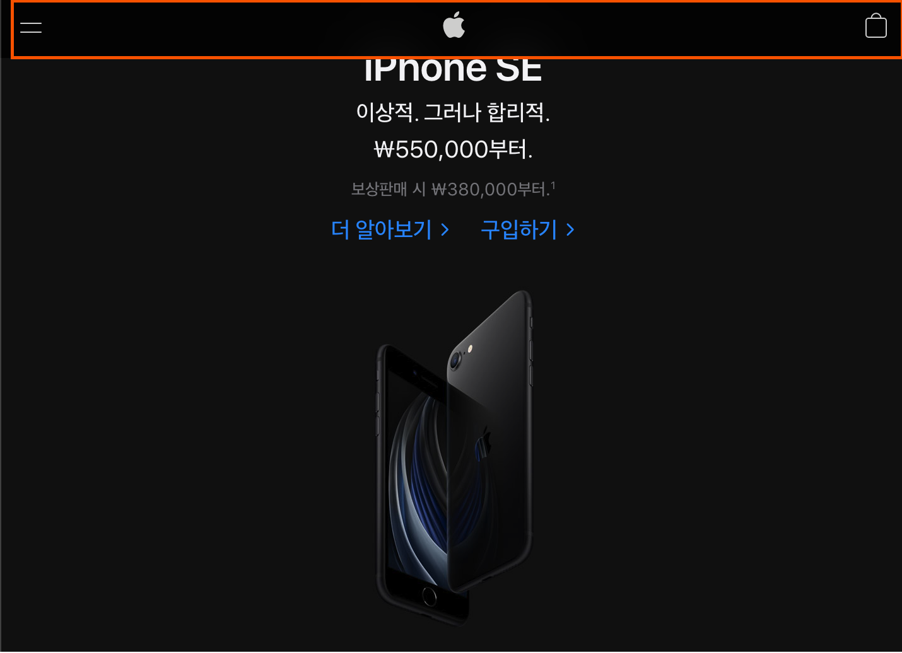
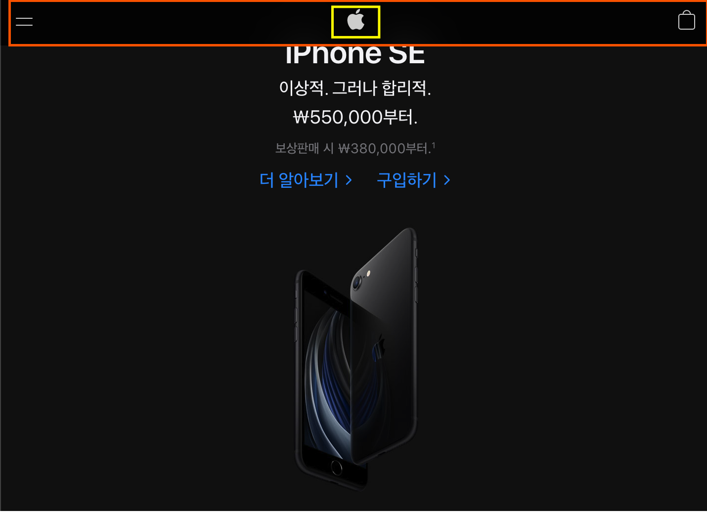
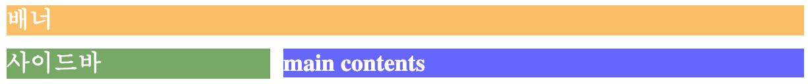

# CSS 레이아웃 기본
## CSS Position, Inline vs. Block, Float 

# Position
본래 HTML 태그는 코딩하는 순서대로 화면에 나타나게 되어있다. 하지만, CSS **Position** 속성을 이용하면 HTML 태그들의 위치를 고정시키거나 옮길 수 있다. 

이 속성을 이용해서 구현하는 가장 대표적인 예는 스크롤을 내려도 계속해서 위치가 유지되는 상단 메뉴바다. 또는 웹앱에서 오른쪽 아래에 둥둥 떠다니는 채팅기능도 Position 속성도 fixed 를 사용한 것이다. 

Position 이라는 속성의 이름 그대로 요소가 어디에 위치할지를 정할 수 있다. 

대표적으로는 
- fixed
- absolute 
- relative
이렇게 세가지가 있다.

## fixed 
`position: fixed` 속성은 화면에 요소를 고정 시킨다.
그리고 어느 곳에 위치 시킬지는 `top, right, bottom, left`의 속성을 이용해서 위치 시키면 된다. 이 네가지 속성은 `position` 속성이 선언된 곳에서만 작동한다. 

[Apple 공식 홈페이지](https://www.apple.com/kr/)
에 접속해서 스크롤을 내려보면 상단에 하얀 사과마크와 검은색 메뉴바가 고정된 채로 내용들만 스크롤이 되는 것을 확인할 수 있다.



```css
body {
  background-color: #eee;
  height: 800px;
  padding-top: 48px; 
  /* body 태그 자체에 padding-top 값을 주어서 fixed된 헤더랑 내용이 겹치지 않도록 한다.  */
}

header {
	position: fixed;
	top: 0;
	right: 0; 
  /* 상단바 이기 때문에 top, right, left 에 딱 붙여준다.  */
	left: 0;
  height: 48px; 
	background-color: rgba(45,45,45,0.95); 
  /* // rgba 까지하면 opacity 줄 수 있음 */
}
```

## absolute
위의 Apple 홈페이지의 상단바의 중앙엔 사과마크가 있다. 



이 사과마크는 상단바의 정 중앙에 **위치** 해 있다. 그리고 위에서 fixed된 상단바 안에 **절대적**으로 위치 해 있다. 왜냐하면 스크롤을 내려도 사과마크는 상단바와 함께 고정되어 있기 때문이다. 

이 사과마크의 위치는 `position: absolute` 를 이용한 것이다. absolute 를 사용할 때 주의할 점은 absolute 속성을 사용할 요소는 항상 `position: relative / fixed / absolute` 세가지 속성 중 하나를 사용한 부모 안에 속해 있어야 한다.

다른 말로하면, 부모 요소에는 항상 `position` 속성을 사용해 화면내에 위치 시키고, 그 위치에 따라서 자식 요소의 **절대적**인 위치를 선언 해 주는 것이다.

사과마크가 바로 그 예다. 위의 상단바의 코드에 사과마크를 추가하는 css 코드를 작성해보면 아래와 같다.

```css
.header-img {
	position: absolute;	
  /* 이미 부모에 position: relative, fixed, absolute 중 하나가 선언되어 있어야 한다. */
	left: 50%; 
  /* 왼쪽으로부터 50% */
	margin-left: -10px; 
  /* 이미지의 크기가 20px 그것의 반만큼 왼쪽으로 패딩을 빼주면 정중앙에 원하는 대로 이미지가 위치하게 된다. */
}
```

## relative
`position: relative` 속성은 이 코드만으로는 의미가 없다. `top, left, bottom, right` 속성과 자식요소에서 `position: absolute` 속성을 사용하기 위한 선언적인 의미를 가지고 있다.

## fixed, absolute, relative 정리
- `position: fixed`: 상위 부모의 position 속성 여부와 상관없이 단독적으로 사용될 수 있다. 말그대로 화면에 **고정** 되는 속성
- `position: absolute`: 상위 부모에 `position: fixed, absolute, relative` 중 하나가 선언이 되어 있어야 자신의 자리를 **절대**적으로 찾을 수 있다.
- `position: relative`: 보통 자식 요소가 `position: absolute` 속성을 사용하기 위해서 부모 요소에 필수적으로 선언되어야 한다.

# Inline vs Block 
들어가기에 앞서 멋진 그림과 함께 쉽게 설명되어 있는 **1분코딩**님의 웹페이지 링크를 걸어둔다.
[1분 코딩 display 속성](https://studiomeal.com/archives/282)

이 두가지 속성은 아주 중요한 정보를 담고있다. 태그의 **본질**을 담고있는 속성이기 때문이다. 여기서 **본질** 이라고 하면, "화면에 이 요소가 어떻게 나타나는가?" 에 대한 이야기다. 

본론으로 들어가면 
- `display: inline;` 같은 줄(화면상에서 너비)에 함꼐 끼어들어가는 속성이고. 
- `display: block;` 은 마치 상자처럼 쌓이는 속성이다. inline 과는 반대로 같은 줄에 다른 요소가 들어오는 것을 거부한다.

HTML의 여러 태그들은 위의 두가지 **본질** 중 한가지 속성을 가지고 있다. 

예를들어서,
- 이미지를 집어넣는 태그 `` 와 링크를 넣는 태그인 `<a>` 태그는 Default로 `display: inline` 속성을 가지고 있다. 이 태그들은 우리가 글을 쓸 때 텍스트가 너비를 모두 차지하면 아래줄로 내려가듯, 공간이 부족하면 다음줄로 자동으로 넘어간다.
- 단락을 의미하는 `<p>` 태그와 division을 의미하는 `<div>` 태그는 `display: block` 속성을 가지고 있다. 주변에 다른 요소가 오는 것을 싫어하는 놈이다. 그래서 독자적으로 자신만의 `width`와 `height` 을 가질 수 있다. 

그렇다면, 한 번 위와같이 본질이 정해지면 절대로 바꿀 수 없는 것인가? 

그렇지 않다. 기본으로 `display: inline` 값을 가지는 `<a>` 태그에 `display: block`으로 속성을 지정하면 `<p>` 또는 `<div>` 태그 처럼 행동한다.

## inline-block?
`display: inline-block` 속성을 이용하면 block 이지만 inline 속성을 가지고 있는 태그들 처럼 행동하게 한다.

즉, block 요소처럼 `width`와 `height` 속성으로 크기를 지정할 수 있고, 이 요소가 inline 처럼 같은 줄에 다른 요소와 함꼐 배치될 수 있다.

# Float
[Reference](https://ko.learnlayout.com/float-layout.html)

`float` 속성은 말그대로 요소를 화면에 **띄운다**. 이 `float` 속성은 모던 웹페이지들의 레이아웃을 구현하는데 필수적으로 사용되었던 요소들이다. 지금은 `Flex`나 `Grid` 에 자리를 내어주게 되었다.

이 글에서는 간단하게 `float` 를 통해서 어떻게 요소들의 섹션을 나누고 레이아웃을 구현 할 수 있는지를 살펴보려고 한다.

다음과 같은 레이아웃을 구현한다고 해보자. 보통의 웹페이지에서 많이 사용되는 레이아웃이다.



위에는 상단바가 있고, 그 아래 내용을 담고있는 페이지다.왼쪽에는 카테고리나 글의 목록을 나타내는 사이드바 그리고 그 오른쪽에는 클라이언트가 보게 될 내용들이 담겨있다.

이를 css 코드로 구현 하면 다음과 같다.
```css
header {
  background-color: orange;
  opacity: 0.6;
  color: white;
  font-weight: bold;
}

aside {
  background-color: green;
  opacity: 0.6;
  color: white;
  font-weight: bold;
}

section {
  background-color: blue;
  opacity: 0.6;
  color: white;
  font-weight: bold;
}

/* float 속성 사용 */
.main-page aside {
	width: 200px;
	float: left;
  /* 왼쪽에 aside 요소를 띄운다. */
	margin-top: 10px;
}

.main-page section {
	margin-top: 10px;
	margin-left: 210px;
  /* 오른쪽에 위치할 section 태그의 왼쪽에 margin 을 넣는다. */
}
```

핵심코드는 .main-page aside selector 안의 속성인 `width: 200px`, `float: left`와 .main-page section selector 속성인 `margin-left: 210px` 이다.

핵심코드에 대한 설명을 덧붙이면 왼쪽의 사이드바의 너비는 200px 에 왼쪽에 **띄운다**. 이 사이드바의 오른쪽에 위치할 태그인 section 태그에 왼쪽 마진을 210px 을 주어서 **띄어진** 사이드바와 겹치지 않도록 레이아웃을 구현할 수 있다.
