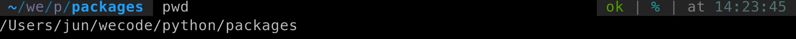
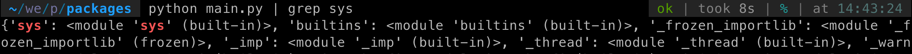

# Python Module and Packages
# 예제를 통해 이해하는 python module, packages

파이썬에서 내가 작성한 파이썬 코드나, 다른 사람이 작성한 파이썬 코드를 가져다가(import) 원하는 대로 사용하고 싶다. 어떻게 해야할까?

바로 `python module`과 `packages` 를 사용하면 된다. 이 두 개념은 리눅스의 디렉토리 구조와 밀접한 관련이 있다. 따라서 이론으로 이해하기 보다 직접 코드와 명령어를 작성 해 보며 직관적으로 이해하는 것이 좋다.

# 1. sys.modules & sys.path
먼저 원하는 곳의 디렉토리 경로에 `main.py` 파일을 하나 만든다. 나는 맥을 사용하고 있으므로, `/Users/jun/wecode/python/packages/` 경로 안에 파일을 만들었다.



현재 경로에서 main.py를 다음과 같이 작성했다.
```python
## main.py
import sys

print(sys.modules)

for path in sys.path:
  print(path)
```
sys 모듈을 임포트하고, 각각 dot natation 을 사용해 modules와 path를 print 하면 다음과 같은 결과가 나온다.
```
==== print(sys.modules) ====
{'sys': <module 'sys' (built-in)>, 'builtins': <module 'builtins' (built-in)>, '_frozen_importlib': <module '_frozen_importlib' (frozen)>, '_imp': <module '_imp' (built-in)>, '_thread': <module '_thread' (built-in)>, '_warnings': <module '_warnings' (built-in)>, '_weakref': <module '_weakref' (built-in)>, 'zipimport': <module 'zipimport' (built-in)>, '_frozen_importlib_external': <module '_frozen_importlib_external' (frozen)>, '_io': <module 'io' (built-in)>, 'marshal': <module 'marshal' (built-in)>, 'posix': <module 'posix' (built-in)>, 'encodings': <module 'encodings' from '/u ... (생략)

==== for path in sys.path ====
/Users/jun/wecode/python/packages
/usr/local/Cellar/python/3.7.7/Frameworks/Python.framework/Versions/3.7/lib/python37.zip
/usr/local/Cellar/python/3.7.7/Frameworks/Python.framework/Versions/3.7/lib/python3.7
/usr/local/Cellar/python/3.7.7/Frameworks/Python.framework/Versions/3.7/lib/python3.7/lib-dynload
/Users/jun/Library/Python/3.7/lib/python/site-packages
/usr/local/lib/python3.7/site-packages
```

print를 통해서 sys 모듈의 각각의 속성을 살펴봤더니 명시적인 차이점은 modules는 딕셔너리 자료형이고, path는 배열로 값들이 들어있다. 각각 하는 기능이 다르기 때문에 다른 자료구조형으로 구현이 되어있다. 

- sys.modules: 다른 파이썬 파일(모듈)이나 파이썬 파일의 모음 디렉토리(패키지)를 찾기 위해서 가장 먼저 확인하는 곳이다. 이 곳에는 이미 불러와진(import) 모듈이나 패키지가 딕셔너리 자료구조로 저장되어 있다. 딕셔너리형이 사용된 이유는 한 번 import 되면 다시 불러올 필요가 없기 때문이다. Hash Map 형태이기 때문에 바로 import된 모듈의 이름으로 key 값(경로)를 찾아 낼 수 있다.
- sys.path: 파이썬에서 이미 import된 모듈과 패키지들이 들어있는 sys.modules를 확인하고 기본 내장 라이브러리들이 들어있는 `built-in modules` 확인하고 `sys.path` 를 마지막으로 확인한다. 이 경로들에서 내가 import를 할 모듈과 패키지가 있는지 확인한다. 따라서 이 sys.path는 살펴볼 경로만 담고 있기 때문에 딕셔너리 자료구조가 아니라 List(배열)로 구현되어 있다.

# 2. Built-in modules 
위의 `main.py` 코드에서 `import sys`를 통해서 `sys.modules` 와 `sys.path` 에 접근할 수 있었다. 그럼 대체 이 sys라는 모듈은 어디서 온 것일까?

위에서 작성한 파일에 다음과 같은 명령어를 통해서 찾아낼 수 있다.


built-in 이란 곳에 있다고 확인할 수 있다.

Built-in modules란 파이썬에서 제공하는 공식 내장 라이브러리다. 다른말로하면 내 로컬의 어느곳에서 파일을 작성하던지 이 내장 모듈들은 어디서나 사용할 수 있다. 

대표적으로 위에서 살펴본 sys, dictionary 자료형, queue 자료형 등이 있다.

# 3. Absolute path vs. Relative path
Python의 절대경로와 상대경로를 통한 모듈과 패키지를 불러오는 방법은 리눅스의 디렉토리/파일 의 트리구조를 이용한다. 

따라서, 기본적으로 리눅스의 파일시스템 구조를 이해하면 사용할 수 있는 자유도가 훨씬 높아진다. 

- 절대경로: import 하는 파이썬 파일의 현재 경로에 상관없이 항상 경로가 동일하기 때문에 **절대** 경로다.
- 상대경로: import 하는 파이썬 파일의 현재 경로에 **상대**적으로 경로가 정해지기 때문에 **상대** 경로다.

절대경로와 상대경로에 대한 이해를 위해서 위에서 작성한 main.py를 수정하고 패키지를 만들어서 절대경로와 상대경로에 대한 이해를 이어나간다.

파일경로 구조
```
├── calculator
│   ├── __init__.py
│   └── add_and_multiply.py
│   └── multiplication.py
└── main.py 
```

## main.py
```python
# absoulte path
from calculator.add_and_multiply import add_and_multiply 

# relative path
from .calculator.add_and_multiply import add_and_multiply # Error!

if __name__ == '__main__':
    print(add_and_multiply(1,2))
```

`main.py` 파일에서 아래 작성한 `add_and_multiply` 함수를 불러오기 위해서 절대 경로를 사용 할 수 있다.

코드의 가장 상단에 작성된 것이 절대경로로 모듈을 불러오는 형태인데 기본적으로 절대경로로 모듈을 import 할 때에는 현재의 디렉토리(`/Users/jun/wecode/python/packages/`)가 sys.path에 포함되게 된다. 그러므로 절대경로를 사용할 때 현재의 디렉토리를 생략하고 바로 파일구조부터 작성할 수 있게 된다. 따라서 현재 packages 디렉토리 안에 들어있는 `calculator.add_and_multiply.py` 모듈을 바로 불러올 수 있게 된다. 

그 아래에 있는 `from .calculator.add_and_multiply import add_and_multiply`를 살펴보자. 이 상태 그대로 코드를 실행시켜보면 다음과 같은 에러를 만나게 된다. 

```
Traceback (most recent call last):
  File "main.py", line 5, in <module>
    from .calculator.add_and_multiply import add_and_multiply
ImportError: attempted relative import with no known parent package
```

[Intra-package References](https://docs.python.org/3/tutorial/modules.html#intra-package-references)

위의 레퍼런스를 살펴보면 이유를 발견할 수 있다. 상대경로를 통한 import는 현재 모듈의 이름에 기반한다. main.py(메인 모듈)의 이름은 항상 `__main__` 이기 때문에 파이썬 앱에서 메인 모듈로 사용하기를 원하는 모듈들은 항상 **절대경로**를 사용해야 한다.

쉽게 말하면, main.py 모듈에서는 다른 모듈이나 패키지를 import 할 때 **절대경로**를 사용해야 한다. 상대경로를 사용하면 위와같이 에러가 발생한다.

## add_and_multiply.py
```python
# relative path
from .multiplication import multiply

# absolute path
from calculator.multiplication import multiply

def add_and_multiply(a,b):
    return multiply(a,b) + (a+b)
```

이 `add_and_multiply.py`모듈은 `/Users/jun/wecode/python/packages/` 를 현재경로(Current Path)를 가지는 앱 안에 `calculator` 패키지에 속한 모듈이 된다.

따라서 Relative Path(상대경로)를 사용할 수 있게 된다. 왜냐하면 상대적으로 비교할 수 있는 뿌리가 생겼다고 볼 수 있기 때문이다. 이 모듈을 호출하는 `main.py` 의 현재 경로(sys.path)가 기준이 된다고 볼 수 있다.

.(dot notaion) 을 찍으면 현재의 경로를 의미하고 아래 트리구조에서 `multiplication.py` 모듈을 불러올 수 있게 되는 것이다. 
```
├── calculator
│   ├── __init__.py
│   └── add_and_multiply.py
│   └── multiplication.py
└── main.py 
```

절대경로를 사용해서 `multiplication.py` 를 임포트할 때에도 결론적으로는 같은 개념이 적용된다. 이미 이 모듈은 `/Users/jun/wecode/python/packages/` 를 기본경로(Current Path)로 가지기 때문이다.

## __init__.py 
```
├── calculator
│   ├── __init__.py
│   └── add_and_multiply.py
│   └── multiplication.py
└── main.py 
```

다시 위의 트리구조를 보면 `__init__.py` 라는 파일이 보인다. 파이썬에서는 밑줄(underbar) 두개 안에 감싸진 메소드를 special method라고 한다. 특별 취급을 받는 함수다. 

파이썬에서 클래스를 실체화 할 때 가장 처음으로 실행되는 메소드가 `__init__(self, ...)` 이다. 

같은맥락에서 `__init__.py` 도 특별 취급을 받는다고 보면 된다. 즉, 패키지를 import 할 때 가장 처음으로 실행되는 모듈이라고 보면된다.

실행순서의 측면에서보면, `class = packes` => `__init__ = __init__.py` 인 셈이다. 클래스가 실체화 될 때 `__init__` 메소드가 실행되듯, 패키지가 import 될 때 `__init__.py` 모듈이 실행된다. 

이 `__init__.py` 이 가장 먼저 실행되는 특성을 통해 얻을 수 있는 큰 장점 두가지가 있다.

1. import 할 때 절대경로의 총 길이를 줄이기
2. Package 에서 import 할 수 있는 모듈을 제한하기

## 1. import 할 때 절대경로의 총 길이 줄이기
위의 calculator 예를 이용하면 다음과 같이 된다.

**main.py** 에서 절대 경로로 import 했던 `add_and_multiply` 모듈을 `__init__.py` 를 통하면 경로를 줄일 수 있다.

**calculator/init.py**
```python
from .add_and_multiply import add_and_multiplay as my_func # 같은 경로의 모듈인 add_and_multiply 모듈에서 add_and_multiply 함수를 import 해서 my_func 이라고 하겠다
```

**main.py**
```python
# absoulte path
# from calculator.add_and_multiply import add_and_multiply 

# __init__.py 이용해서 경로 줄이기
from calculator import my_func

if __name__ == '__main__':
    print(my_func(1,2))
```
즉 절대 경로로 명시했던 경로가 패키지만 쓰여지는 간단한 경로로 바뀌었다. 그리고 이 예제에서는 `my_func` 라는 이름을 사용했지만, `as` 문을 통해서 얼마든지 자신이 원하는 이름으로 바로 함수나 객체 그리고 변수를 import 할 수 있다는 장점이 있다.


## 2. import 할 수 있는 변수/함수/클래스 제한하기
우리가 작성하는 패키지에는 엄청나게 다양하고 많은 변수, 함수, 클래스가 존재할 것이다. 하지만 우리는 이 모든 것들을 사용하고 싶지 않다. 

애초에 내보낼(export 할 또는 다른 파일에서 import 할) 변수, 함수, 클래스를 지정해 놓는다면 어떨까?
- 코드를 작성하기 전 구조에 대해서 미리 생각해 보게 된다.
- 유지보수의 시간이 훨씬 줄어든다.
- 우선순위를 정할 수 있다.

문법은 `__all__` 변수를 사용하면 된다. 특별 메소드와 같이, 특별히 여겨지는 변수라고 이해할 수 있다.
즉, `__init__.py` 안에서 `__all__` 변수를 선언하고 배열의 형태로 그 안에 내보낼 변수/함수/클래스를 지정 해 놓으면, 바깥의 파이썬 파일에서는 이 패키지로 부터 오로지 `__all__` 에 명시한 것들에만 접근할 수 있게 된다. 

**calculator/__init__.py**
```python
from .add_and_multiply import add_and_multiplay as my_func # 같은 경로의 모듈인 add_and_multiply 모듈에서 add_and_multiply 함수를 import 해서 my_func 이라고 하겠다

__all__ = ['my_func'] # 이제 calculator 패키지에서 import 할 때에는 이 함수만 사용할 수 있게 된다.
```