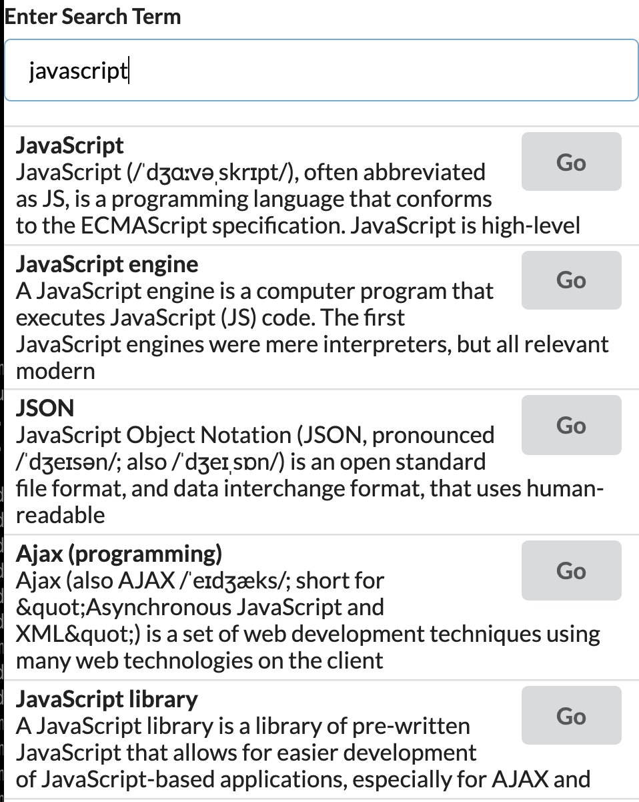

# ReactHooks101 - Throttling by using useEffect Hook
## 검색할 때, Throttling 기능 넣기

React Hooks 의 다양한 함수들 중 하나인 useEffect 훅을 사용해서 Throttling(쓰로틀링) 기능을 구현해보자.

> Throttling(쓰로틀링): 마지막 함수가 호출된 후 일정 시간이 지나기 전에 다시 호출되지 않도록 하는 것. 쓰로틀링은 보통 성능 문제 때문에 많이 사용한다. 왜냐하면 실행 횟수에 제한을 걸기 때문이다. JavaScript 이벤트와 관련해서는, 이벤트 호출 시 일정 시간 뒤에 호출 하도록 한다. 출처:https://www.zerocho.com/category/JavaScript/post/59a8e9cb15ac0000182794fa

# 상황설정



리액트 프로젝트의 src 폴더 안의 구조는 다음과 같다.
```
├── App.js
├── components
│   ├── Accordion.js
│   └── Search.js
└── index.js
```

가장 상위 컴포넌트인 App.js 에서 Search 컴포넌트를 임포트해서 사용한다. 
Search 컴포넌트의 내용은 간단하다. SearchBar 의 인풋창에 `onChange` 이벤트가 발생 할 때마다, 위키피디아에 API 요청을 해서 결과를 받아오는 형식이다. 

이벤트를 감지해서, API 요청을 하기 위해서는 `useEffect` 훅을 사용하면 된다. `useEffect` 훅은 함수형 컴포넌트에서 클래스 기반 컴포넌트의 LifeCycle 메소드를 대체할 수 있다. 

기본적인 작동방식은 다음 [레퍼런스](https://reactjs.org/docs/hooks-effect.html)를 참고하면 좋다. 

# without throttling
코드와 함께 Search 컴포넌트의 구조를 좀 더 자세히 살펴보자.

## Search.js (Functional Component) 
```javascript
import React, { useState, useEffect } from 'react';
import axios from 'axios';

const Search = () => {
  const [searchTerm, setSearchTerm] = useState('programming');
  const [searchResults, setSearchResults] = useState([]);

  useEffect(() => { // first argument is a function which shouldn't be an async func
    const search = async () => {
      const { data } = await axios.get("https://en.wikipedia.org/w/api.php", {
        params: {
          action: 'query',
          list: 'search',
          origin: '*',
          format: 'json',
          srsearch: searchTerm
        }
      });

      setSearchResults(data.query.search.map((element) => {
        let { snippet } = element;
        snippet = snippet.replace(/<.+?>/g, ""); // matches html tag
        return {...element, snippet};
      }));
    }

    if (!searchTerm) setSearchResults([]);
    // without Throttling
    if (searchTerm) search();

  }, [searchTerm]);

  const renderedResulsts = searchResults.map((result) => {
    return(
      <div key={result.pageid} className="item">
        <div className="right floated content">
          <a 
            className="ui button"
            href={`https://en.wikipedia.org?curid=${result.pageid}`}
          >
            Go
          </a>
        </div>
        <div className="content">
          <div className="header">
            {result.title}
          </div>
          {result.snippet}
        </div>
      </div>
    );
  });

  return (
    <div>
      <div className="ui form">
        <div className="field">
          <label>Enter Search Term</label>
          <input 
            value={searchTerm}
            onChange={(e) => setSearchTerm(e.target.value)}
            className="input"
          />
        </div>
        <div className="ui celled list">
          {renderedResulsts}
        </div>
      </div>
    </div>
  );
};

export default Search;
```
컴포넌트 상단에 `useEffect` 훅을 임포트하고, 함수형 컴포넌트 안에서 바로 사용가능하다.

## 1. useEffect 사용법
```javascript
 useEffect(() => { // first argument is a function which shouldn't be an async func
  ... searchTerm 이 변경될때마다 실행 될 함수 내부 로직
  바로 다음 항목인 2. useEfffect 첫번째 인자로 들어온 함수 내부에서 상세하게 설명한다.
  }, [searchTerm]);
```

`useEffect` 훅의 첫번째 인자는 함수, 두번째 인자는 첫번째 인자로 들어온 함수가 실행될 **의존**배열을 받는다. 두번째 인자는 항상 배열의 형태이고, 빈 배열이라면 클래스 기반 컴포넌트의 `componentDidMount` 메소드처럼, 배열안에 우리가 변화를 감지할 state를 적어주면 이 state가 바뀔때마다 첫번째 인자로 들어온 함수가 실행된다. 마치 `componentDidUpdate` 같은 개념이다. 하지만, 훅의 장점은 이 의존배열로 인해서 변화를 감지할 state를 따로 분리 할 수 있다. 현재 Search 컴포넌트 안에서 변화를 감지할 state는 input 창에 들어오는 값이기 때문에 `searchTerm` 을 배열의 인자로 넣어주었다. 즉, `onChange` 이벤트가 발생할 때마다 `setSearchTerm` 함수로 값을 업데이트 하고 있기 때문에 이 `useEffect` 훅의 들어온 첫번째 함수가 **항상** 실행되는 상태이다. 항상 실행된다는 점에 주목해야 한다. 여기서 Throttling(쓰로틀링)이 힘을 발휘하기 때문이다.

## 2. useEffect 첫번째 인자로 들어온 함수 내부
```javascript
useEffect(() => { // first argument is a function which shouldn't be an async func
  const search = async () => {
    const { data } = await axios.get("https://en.wikipedia.org/w/api.php", {
      params: {
        action: 'query',
        list: 'search',
        origin: '*',
        format: 'json',
        srsearch: searchTerm
      }
    });

    setSearchResults(data.query.search.map((element) => {
      let { snippet } = element;
      snippet = snippet.replace(/<.+?>/g, ""); // matches html tag
      return {...element, snippet};
    }));
  }

  if (!searchTerm) setSearchResults([]);
  // without Throttling
  if (searchTerm) search();

}, [searchTerm]);
```
- `useEffect` 에 첫번째 인자로 들어가는 함수는 **절대** async 함수가 될 수 없다. 따라서 API로 데이터를 불러오는 기능을 넣기 위해서는 `Helper Function` 을 따로 만들어 줘야 한다. `useEffect` 훅안에 위와 같이 함수를 선언할 수 있다. 
- `search` 함수 내부 로직을 보면 위키피디아 API에 데이터를 요청한다. [axios](https://www.npmjs.com/package/axios) 라이브러리를 사용했고, 프로미스를 반환하기 때문에 await 를 사용해서 데이터 응답을 받아왔다. 이 때 `params` 는 URL 끝에 들어갈 파라미터를 뜻하고, `srsearch: searchTerm` 을 통해서 실제 검색하고자 하는 키워드와 함께 요청을 보낸다.
- 받아온 데이터에 대해 `setSearchResults` 함수를 통해서 `searchResults` 상태를 업데이트한다.

위의 로직은 `searchTerm`이 바뀔때마다 실행되기 때문에 input 창에 키를 입력 할 때마다. **키를 입력 할 때마다.** API에 요청을 보낸다는 것이다. 이렇게 되면, 계속해서 네트워크 요청을 하는 것 이기 때문에, 성능저하의 포인트가 된다. 

따라서 Throttling(쓰로틀링)이 필요한 시점이다. 쓰로틀링을 사용하게 되면, input창에 입력값이 바뀔 때마다 `search` 함수를 통해 API 요청을 하지 않고, 실행 횟수를 조절할 수 있게 된다. 

쓰로틀링의 개념을 다시 한 번 언급하면 다음과 같다.

> Throttling(쓰로틀링): 마지막 함수가 호출된 후 일정 시간이 지나기 전에 다시 호출되지 않도록 하는 것. 쓰로틀링은 보통 성능 문제 때문에 많이 사용한다. 왜냐하면 실행 횟수에 제한을 걸기 때문이다. JavaScript 이벤트와 관련해서는, 이벤트 호출 시 일정 시간 뒤에 호출 하도록 한다. 출처:https://www.zerocho.com/category/JavaScript/post/59a8e9cb15ac0000182794faa

# with throttling

## useEffect의 return
`useEffect` 에 첫번째로 들어가는 함수는 함수를 return 할 수 있다. 위의 코드를 살펴보면, 첫번째 인자로 들어가는 `() => ` arrow function 안의 가장 마지막에 return 문을 보면 다시금 `() => ` arrow function 을 리턴한다. 이렇게 `return` 으로 반환되는 함수는 다음번 `useEffect` 훅이 불려져서 첫번째 인자로 들어온 함수가 실행되기 바로 전에 실행이 된다. 

`useEffect` 훅이 작동하는 원리를 조금 더 자세히 살펴보기 위해 코드를 간단화 하면 다음과 같다.
```javascript
useEffect(() => {
  console.log('Initial render or term has changed');

  return () => { // some clean up
    console.log('CLEANUP'); // as soon as we make a change, this function gets called automatically
  };

}, [searchTerm]);
```

1. 처음에 컴포넌트가 렌더링 될 때 useEffect의 첫번째 인자로 들어온 익명함수가 실행되기 때문에 콘솔창에 `Initial render or term has changed`가 찍힌다.
2. input 창에 검색어를 입력해서 이벤트를 발생시키면 `searchTerm` 상태가 업데이트 되고, `useEffect` 의 첫번째 인자로 들어온 익명함수가 실행된다. 이 때, `return` 뒤에 명시된 익명함수가 먼저 실행되고, 함수안의 로직이 실행되는 형태다. 

따라서 input 창에 키입력 이벤트가 발생할 떄마다 개발자도구의 콘솔창에 찍히는 로그의 순서는 다음과 같다.
```
Initial render or term has changed (처음 컴포넌트가 렌더링 되었을 때)
(이벤트 발생)
CELANUP 
Initial render or term has changed
(이벤트 발생)
CELANUP 
Initial render or term has changed
(이벤트 발생)
CELANUP
Initial render or term has changed
...
```

우리는 이 `useEffect` 훅의 실행되는 특징을 통해서 쓰로틀링을 구현할 수 있다.

```javascript
      // with Throttling
      const timeoutId =  setTimeout(() => {
        if (searchTerm) search();
      }, 1000);

      return () => { // useEffect first parameter function return
        clearTimeout(timeoutId);
      };
```
이 부분을 잘 살펴보자.  
- `setTimeout` 함수는 리턴값으로 자기자신의 고유한 ID를 반환한다. 그리고 `clearTimeout`함수의 인자로 이 고유한 ID를 넘겨주어 실행시키면, setTimeout 안에 옵션으로 준 시간이 흐른 후에 실행하기로 한 함수가 실행되지 않고 취소 된다. 
- 따라서, `useEffect` 훅이 실행시킬 첫번째 인자의 익명함수 안의 return 에 들어갈 익명함수 안에 `clearTimeout` 함수를 넣어주면, 다음 번 이벤트가 발생할 때, 이전에 `setTimeout` 에 의해 발생한 타이머가 취소되게 된다. 

```
.
.
.
(최초 이벤트발생)
setTimeout(타이머1)

(이벤트발생)
clearTimeout(타이머1): 이전 타이머1 지움
setTimeout(타이머2): 새로운 타이머2

(이벤트발생)
clearTimeout(타이머2): 이전 타이머2 지움
setTimeout(타이머3): 새로운 타이머3

(이벤트발생)
clearTimeout(타이머3): 이전 타이머3 지움
setTimeout(타이머4): 새로운 타이머4

(이벤트발생)
clearTimeout(타이머4): 이전 타이머4 지움
setTimeout(타이머5): 새로운 타이머5

(이벤트발생)
clearTimeout(타이머5): 이전 타이머5 지움
setTimeout(타이머6): 새로운 타이머6

(1초뒤)
타이머6안에 넣어준 함수 실행 => 즉, search 함수가 실행되어서 이제서야 실제 API 요청이 들어간다.
.
.
.
```

이렇게 쓰로틀링 기능을 구현하면, 검색창에 입력이 들어갈때마다 API 데이터 요청을 하지않고, 일정시간(setTimeout 함수에 옵션으로 준 시간)이 지난후에만 API 요청을 하게 된다. 

Search 컴포넌트의 최종 코드는 다음과 같다.
```javascript
import React, { useState, useEffect } from 'react';
import axios from 'axios';

const Search = () => {
  const [searchTerm, setSearchTerm] = useState('programming');
  const [searchResults, setSearchResults] = useState([]);

  useEffect(() => { // first argument is a function which shouldn't be an async func
    const search = async () => {
      const { data } = await axios.get("https://en.wikipedia.org/w/api.php", {
        params: {
          action: 'query',
          list: 'search',
          origin: '*',
          format: 'json',
          srsearch: searchTerm
        }
      });

      setSearchResults(data.query.search.map((element) => {
        let { snippet } = element;
        snippet = snippet.replace(/<.+?>/g, ""); // matches html tag
        return {...element, snippet};
      }));
    }

    if (!searchTerm) setSearchResults([]);

    if (searchTerm && !searchResults.length) search(); // first rendered
    else {
      // with Throttling
      const timeoutId =  setTimeout(() => {
        if (searchTerm) search();
      }, 1000);

      return () => { // useEffect first parameter function return
        clearTimeout(timeoutId);
      };
    }

  }, [searchTerm]);

  const renderedResulsts = searchResults.map((result) => {
    return(
      <div key={result.pageid} className="item">
        <div className="right floated content">
          <a 
            className="ui button"
            href={`https://en.wikipedia.org?curid=${result.pageid}`}
          >
            Go
          </a>
        </div>
        <div className="content">
          <div className="header">
            {result.title}
          </div>
          {result.snippet}
        </div>
      </div>
    );
  });

  return (
    <div>
      <div className="ui form">
        <div className="field">
          <label>Enter Search Term</label>
          <input 
            value={searchTerm}
            onChange={(e) => setSearchTerm(e.target.value)}
            className="input"
          />
        </div>
        <div className="ui celled list">
          {renderedResulsts}
        </div>
      </div>
    </div>
  );
};

export default Search;
```