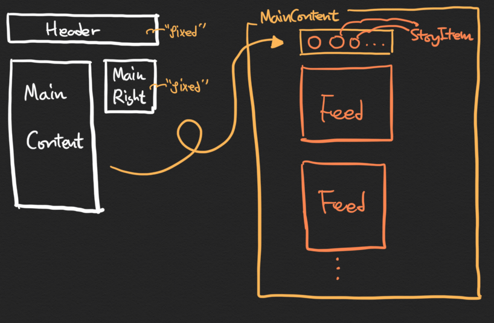

# React 에서 라이브러리 없이 Modal 창 구현하기 
## Instagram clone project using class-based Component 

[인스타그램 클론 프로젝트 전체코드](https://github.com/wecode-bootcamp-korea/10-React-Westagram-2/tree/master/src/pages/junchoi)


화면상에 나타나는 UI를 보이는 대로/기능 대로 나눈 것을 컴포넌트라고 하는데, 인스타그램은 간단하고 재사용가능한 작은 컴포넌트로 이루어진 React 앱이다. 따라서, Single Page Application 의 대표주자인 React 라이브러리의 철학을 이해하는데 인스타그램 클론 프로젝트는 큰 도움이 되었다. 

이 번 프로젝트에서 주안점을 두었던 것은 React 의 기초가 되는 class-based 컴포넌트의 이해였다. class-based 컴포넌트가 중요한 이유는 바로 life-cycle(생명주기) 메소드들 때문이다. 예를 들어 화면상에 나타나는 인스타그램 피드 하나하나 모두 생명을 갖고 있고, 태어나서 사라질 때까지 여러 과정을 거친다. 거칠게 비유해 보자면, 태어날 때(`constructor()`), 유아기(`componentDidmount()`), 여러 이벤트가 발생하는 청소년기(`componentDidUpdate()`), 그리고 노년(`componentWillUnmount`)까지의 다양한 React 클래스 메소드들이 구현되어 있다. 

각자의 메소드에 대한 이해는 어떻게 우리가 UI/UX 를 처리할지에 대한 명확한 방향을 제시 해 준다. 
s
컴포넌트의 생명주기 메소드들과 이벤트 처리에 대한 조한 더 깊은 이해를 위해서 나는 인스타그램에서 제공하는 Story 기능을 구현 해보기로 했고, 하루에 걸쳐서 레이아웃을 따고, React 코드를 다듬으며 기능을 추가 했다. 

# 1. React에서는 어떻게 모달을 구현할까?
먼저 코드를 작성하기 전에, 컴포넌트를 어떤 식으로 나누고, 이벤트 처리를 어떻게 할것인지에 대한 지도가 필요하다. 다음 이미지는 메인페이지의 컴포넌트 구성이다. 



`<MainContet />` 컴포넌트 안에서 각자의 스토리와 피드 데이터(user id, thumbnail, 사진, 댓글 등..)가 담긴 객체를 map 함수로 props 와 함께 넘겨주며 `<StoryItem />`, `<Feed />` 컴포넌트를 렌더링 한다. 

즉, 각각의 화면에 보여지는 스토리와 글의 상태는 이 컴포넌트들을 감싸는 `<MainContent />` 컴포넌트 안에서 관리가 된다.

## 생각보다 쉬운 모달창 렌더하기
가만 생각 해 보면 생각보다 단순하게 우리는 모달창을 렌더링 할 수 있다. React 의 JSX 문법을 활용하면 된다. JavaScript 코드도 아니고 HTML 도 아니지만, JSX를 사용하면 JavaScript를 사용해서 HTML 태그를 렌더링할지 말지를 결정할 수 있다.

그것은 바로 `&&` 연산자

**MainContent.js**
```javascript
import React, { Component } from 'react';
import StoryItem from './StoryItem/StoryItem';
import Feed from './Feed/Feed';
import StoryModal from './StoryModal/StoryModal';
import Dimmer from './Dimmer/Dimmer';
import './MainContent.scss';

class MainContent extends React.Component { 
  state = { stories: [], feeds: [], storyModalStatus : false, storyModal: null, timerId: null };
.
.
.
  render() {
    return(
      <div className="MainContent_J">
        {this.state.storyModalStatus && <StoryModal storyModal={this.state.storyModal} /> }
        {this.state.storyModalStatus && <Dimmer modalOff={this.modalOff} /> }
        <div className="main-stories">
          {this.state.stories.map((story, index) => {
            return <StoryItem key={story.userName + index} 
                      story={story} 
                      onStoryClick={this.onStoryClick}
                      modalOff={this.modalOff}
                   />
          })}
        </div>
        <div className="main-feeds">
          {this.state.feeds.map((feed, index) => {
            return <Feed key={feed.userName + index} feed={feed}/>
          })}
        </div>
      </div>
    );
  }
}

export default MainContent;
```
위의 코드에서 `render()` 함수에서 리턴되는 JSX 코드 중 37, 38번째 줄의 코드를 보면 `&&` 연산자를 사용해서 `<StroyModal />` 과 `<Dimmer />` 컴포넌트를 렌더링 하는 것을 볼 수 있다.

이벤트를 활용하는 것은 **2. on / off 클릭 이벤트 처리하기** 에서 다루기로 하고, 가장 기초적인 것을 설명하자면 `storyModalStatus` 라는 state 객체의 key 값을 생성 해 준다. 그리고 이 boolean 상태값이 false 가 되면 37번, 38번 모달과 관련된 컴포넌트들이 렌더링 되지 않는다. 반대로, true 가 되면 37, 38번째 줄에 쓰여있는 `<StoryModal />` 과 `<Dimmer />` 가 렌더링 된다. 

리액트에서 보여주고자 하는 컴포넌트를 렌더링하는 기본적인 로직은 너무 간단하다. 상태로 true, false 를 관리해서 컴포넌트를 렌더링했다가 렌더링 하지 않도록 하면 된다. 이 때, event를 발생시켜서 `this.setState` 함수로 컴포넌트의 상태를 바꾸면 `render()` 함수가 다시 호출되기 때문이다.

## 즐거우면서도 괴로운 CSS 

**StoryModal.js**
```javascript
import React, { Component } from 'react';
import './StoryModal.scss';

const body = document.querySelector('#body');
class StoryModal extends Component {
  render() {
    const { storyModal } = this.props;

    componentDidMount() {
      body.setAttribute("style", "overflow: hidden;"); // body 태그에 overflow hidden 값을 주어서 scroll 되지 않도록 함.
      this.setState({ status: true });
    }

    componentWillUnmount() {
      body.removeAttribute("style"); // 모달창이 종료되 될 때 body 태그에 준 속성을 제거 해준다.
      this.setState({ status: false });
    }

    return (
      <div className="StoryModal">
        <div className="content">
          .
          . 모달 내용
          .
        </div>
      </div>
    );
  }
}

export default StoryModal;
```

**StoryModal.scss**
```scss
.StoryModal {
  position: absolute;
  top: 0px;
  bottom: 0px;
  right: 0px;
  left: 0px;
  width: 100%;
  height: 100%;
  display: flex;
  justify-content: center;
  align-items: center;
  overflow: hidden;

  .content {
    display: flex;
    flex-direction: column;
    height: 100vh;
    width: 370px;
    position: relative;
    z-index: 201;

    .
    .
    .
```

**Dimmer.js**
```javascript
import React, { Component } from 'react';
import './Dimmer.scss';

class Dimmer extends Component {
  render() {
    return (
      <div className="Dimmer" onClick={this.props.modalOff}>
      </div>
    )
  }
}

export default Dimmer;
```

**Dimmer.scss**
```scss
.Dimmer{
  position: absolute;
  top: 0;
  bottom: 0;
  right: 0;
  left: 0;
  width: 100%;
  height: 100%;
  background-color: rgb(38, 38, 38);
  z-index: 200;
}
```

리액트로 웹앱을 개발하는 일은 즐겁다. 하지만, css를 사용한 레이아웃은 도통 내 마음대로 되지 않는다. 사실 JavaScript로 모달 기능 구현에 쏟은 시간보다 css에 들인 시간이 더 많다. 역시, UI/UX를 담당하는 프론트엔드 개발자에게 css란 계속해서 올라야 할 산과 같다.  

나는 모달창을 렌더링 하는 것을 위에서 설명했듯 `<MainContent />` 컴포넌트 안에서 구현헀다. 이 때 가장 주의해야 할 점은 결국 우리가 모달로 띄울 `<StoryModal />` 과 `<Dimmer />` 컴포넌트 모두 `<MainContent />` 컴포넌트의 **자식** 이라는 점이다. 부모-자식 관계는 굉장히 중요하다. 아니 어쩌면 HTML 과 CSS의 속성들의 본질이다. 

기본적으로 자식은 부모 태그의 너비를 벗어날 수 없다. 그래서, 처음 렌더링을 했을 때 `<MainContent />` 의 너비로 지정한 600px 을 안에 갇혀서 `<StoryModal />` 창이 렌더링 되었다. 

이 문제를 해결하기 위해 사용한 CSS 속성은 바로 `position: absolute` 이다. 만약 부모 중에 포지션이 relative, absolute, fixed 인 태그가 없다면 가장 위의 태그인 `body` 태그가 기준이 된다.

따라서 위의 `StoryModal.scss` 와 `Dimmer.scss` 의 코드를 보면 `position: absolute` 와 함께 `top: 0, bottom:0, right: 0, left: 0` 을 사용해서 렌더링 되는 컴포넌트들이 화면 전체를 사용하는 `body` 태그를 꽉 채우도록 했다. 이 때 `width: 100%, height: 100%` 속성으로 모달창이 화면 전체를 덮기를 원했다.

물론 위에서 작성한 속성으로만 우리가 원하는 결과가 나오는 것이 아니다. 왜냐하면 아직도 `<StoryModal />` 과 검은 배경을 의미하는 `<Dimmer />` 컴포넌트는 부모-자식 간의 관계에서 벗어나지 못 했기 때문이다. 

이 때 해결사로 등장하는 속성이 바로 `z-index` 속성이다. 말그대로 z축(화면에서 우리쪽으로) 에 값을 주어서 어떤 것이 상대적으로 앞에 보일지 결정하는 속성이다. 값으로 주는 정수값이 높을 수록 화면 상단에 배치되게 된다. 

이 속성이 중요한 이유는 검은 배경화면을 나타내는 `<Dimmer />` 컴포넌트가 실제 모달창의 컨텐츠가 담긴 `<StoryModal />` 컴포넌트보다 뒤에 렌더링 되기를 원했다. 왜냐하면, 클릭 이벤트를 발생시켜서 검은 화면을 눌렀을 때에만 모달창이 꺼지도록 구현하고자 했기 때문이다. 만약 같은 `z-index` 값을 가진다면 중앙에 모달의 내용을 나타내는 부분을 클릭해도 모달창이 꺼지게 된다. 

이 버그를 잡으려고 위의 코드에서 볼 수 있다시피 `Dimmer.scss` 에서는 `z-index` 을 200으로 `StoryModal.scss` 에서 실제 모달 내용을 의미하는 content 요소에 `z-index` 201을 주어서 검은 배경화면이 쌓이고, 그 위에 컨텐츠가 쌓일 수 있도록 모달창을 구현했다.

이렇게 따로 `<Dimmer />` 컴포넌트와 `<StoryModal />` 컴포넌트를 빼내지 않고, 한 번에 구현하려다가 머리를 싸맸었다. 그냥 분리해서 같은 층의 요소로 만든 다음에 `z-index` 를 주기로 하자.

# 2. Modal on / off 클릭 이벤트 처리하기
위에서 CSS로 고생하고 나면, 이제 이벤트를 처리 해야 한다.
하지만, 모달창의 렌더링이 어렵지 않았듯 껏다 켰다 하는 일은 더 쉽다. 

다시 한 번 컴포넌트의 구조를 트리 구조로 살펴보면 다음과 같다.
```
├── MainContent
│   ├── Dimmer
│   │   ├── Dimmer.js
│   │   └── Dimmer.scss
│   ├── MainContent.js
│   ├── MainContent.scss
│   ├── StoryItem
│   │   ├── StoryItem.js
│   │   └── StoryItem.scss
│   └── StoryModal
│       ├── StoryModal.js
│       └── StoryModal.scss
```

1. `<StoryItem />` 컴포넌트는 동그랗게 나타나는 스토리 아이콘 들이다. 이 컴포넌트 안에서 클릭 이벤트를 발생시켜서 부모인 `<MainContent />` 의 `this.state.storyModalStatus` 를 true로 바꾸어 주면(`this.setState`) 렌더함수가 다시 실행되서 모달창의 기능을 하는 `<StoryModal />` 과 `<Dimmer />` 컴포넌트가 렌더링 된다.

2. 이번엔 반대로 검은 배경을 담당하는 `<Dimmer />` 컴포넌트에 클릭 이벤트를 걸어서 `<MainContent />` 의 `this.state.storyModalStatus` 를 false 값으로 바꾸어(`this.setState`) 주면 렌더함수가 다시 실행되면서 `<StoryModal />` 과 `<Dimmer />` 컴포넌트가 렌더링 되지 않는다.

이 때 중요한것은 부모 컴포넌트인 `<MainContent />` 에서 선언한 `onStoryClick`, `modalOff` 함수들이 각각 자식 컴포넌트인 `<StoryItem />` 과 `<Dimmer /` 컴포넌트에 props로 전달되어야 한다는 것이다. 

props로 이벤트가 발생할 때 실행될 로직이 담긴 함수(컴포넌트의 메소드)를 전달해서, 그 컴포넌트 안에서 실행시키면 부모의 상태가 바뀌는 magic이 일어난다.

아래 코드를 확인하면 클래스 내에서 생성된 함수(메소드)가 `<Dimmer />` 컴포넌트와 `<StoryItem />` 컴포넌트를 렌더링 할 때, props로 전달되는 것을 확인 할 수 있다.

**Event handling이 추가된 MainContent.js**
```javascript
import React, { Component } from 'react';
import StoryItem from './StoryItem/StoryItem';
import Feed from './Feed/Feed';
import StoryModal from './StoryModal/StoryModal';
import Dimmer from './Dimmer/Dimmer';
import './MainContent.scss';

class MainContent extends React.Component { 
  state = { stories: [], feeds: [], storyModalStatus : false, storyModal: null, timerId: null };

  // event handling //
  onStoryClick = (storyModal, timerId) => {
    this.setState({ storyModalStatus: true, storyModal, timerId });    
  }

  modalOff = () => {
    clearTimeout(this.state.timerId);
    this.setState({ storyModalStatus: false, storyModal: null});
  }

  render() {
    return(
      <div className="MainContent_J">
        {this.state.storyModalStatus && <StoryModal storyModal={this.state.storyModal} /> }
        {this.state.storyModalStatus && <Dimmer modalOff={this.modalOff} /> }
        <div className="main-stories">
          {this.state.stories.map((story, index) => {
            return <StoryItem key={story.userName + index} 
                      story={story} 
                      onStoryClick={this.onStoryClick}
                      modalOff={this.modalOff}
                   />
          })}
        </div>
        <div className="main-feeds">
          {this.state.feeds.map((feed, index) => {
            return <Feed key={feed.userName + index} feed={feed}/>
          })}
        </div>
      </div>
    );
  }
}

export default MainContent;
```

props를 받아서 사용하는 예시로 `<Dimmer />` 컴포넌트의 코드를 보면, 이벤트에 함수를 매핑해준 것 밖에 없다.

**Dimmer.js**
```javascript
import React, { Component } from 'react';
import './Dimmer.scss';

class Dimmer extends Component {
  render() {
    return (
      <div className="Dimmer" onClick={this.props.modalOff}> // 이벤트 발생했을 때 부모로 부터 받은 modalOff 함수 실행
      </div>
    )
  }
}

export default Dimmer;
```

# 3. setTimeout 사용해서 시간안에 모달창이 꺼지게 하기 

말로 설명하는 것보다 코드를 보고 직관적으로 이해하는 것이 편한 것 같아서 코드와 함께 주석 처리를 해 놓았다.

**StoryItem.js**
```javascript
import React, { Component } from 'react';
import './StoryItem.scss';

class StoryItem extends Component {

  onStoryImageClick = () => {
    const { onStoryClick, modalOff } = this.props; // 부모 컴포넌트인 <MainContent /> 에서 받은 storyModalStatus 를 true / false 로 바꾸는 함수 
    const timerId = setTimeout(() => { // 아이콘을 클릭했을 때 setTimeout 함수 실행
      modalOff(); 
    }, 3000); // 3초 뒤에 부모로 부터 받은 modalOff() 함수 실행시켜서 modal 창 꺼지게 하기
    onStoryClick(this.props.story, timerId);
  }

  render() {
    const {thumbnail, userName} = this.props.story;
    return (
      <div className="StoryItem_J">
        <div onClick={this.onStoryImageClick} className="story-image-border">
          
        </div>
        <div className="story-id">
          {userName}
        </div>
      </div>
    );
  }
}

export default StoryItem;
```

**Event handling이 추가된 MainContent.js**
```javascript
import React, { Component } from 'react';
import StoryItem from './StoryItem/StoryItem';
import Feed from './Feed/Feed';
import StoryModal from './StoryModal/StoryModal';
import Dimmer from './Dimmer/Dimmer';
import './MainContent.scss';

class MainContent extends React.Component { 
  state = { stories: [], feeds: [], storyModalStatus : false, storyModal: null, timerId: null }; // 자식 컴포넌트인 <StoryItem /> 에서 발생시킨 setTimeout 함수의 고유한 아이디를 저장시킬 스테이트: timerId

  // event handling //
  onStoryClick = (storyModal, timerId) => { // 모달창이 켜지면 모달창에 뿌려줄 컨텐츠인 storyModal 객체와, setTimeout 함수의 고유한 id를 가져와서 업데이트 한다.
    this.setState({ storyModalStatus: true, storyModal, timerId });    
  }

  modalOff = () => {
    clearTimeout(this.state.timerId); // 모달창이 꺼지는 이벤트가 발생할 때, 가장 최신에 실행된 setTimeout 의 고유한 id를 clearTimeout 함수의 인자로 넘겨주어서, setTimeout 함수의 타이머를 꺼버린다.
    this.setState({ storyModalStatus: false, storyModal: null });
  }

  render() {
    return(
      <div className="MainContent_J">
        {this.state.storyModalStatus && <StoryModal storyModal={this.state.storyModal} /> }
        {this.state.storyModalStatus && <Dimmer modalOff={this.modalOff} /> }
        <div className="main-stories">
          {this.state.stories.map((story, index) => {
            return <StoryItem key={story.userName + index} 
                      story={story} 
                      onStoryClick={this.onStoryClick}
                      modalOff={this.modalOff}
                   />
          })}
        </div>
        <div className="main-feeds">
          {this.state.feeds.map((feed, index) => {
            return <Feed key={feed.userName + index} feed={feed}/>
          })}
        </div>
      </div>
    );
  }
}

export default MainContent;
```

# 마무리
모달 창을 구현하는데 생각보다 꽤 어려운 CSS 속성들과 이벤트 핸들링을 다뤄야 했다.
모달창을 구현할 때 고려해야 할 상황을 정리 해 보자면

1. 어느 곳에서 모달창을 렌더링 할지 결정하기: 부모-자식 관계를 고려해야 하기 때문에
2. 배경과 컨텐츠를 담는 컴포넌트를 두개로 분리하기
3. z-index 를 사용해서 부모 컴포넌트보다 앞쪽에 렌더링 되도록 배치하기
4. 모달 창 on/off 이벤트 핸들링을 할 때, state, props를 사용해서 부모 컴포넌트의 상태를 부모로 부터 props로 전달받은 함수를 실행시켜서 렌더링 하기
5. setTimeout을 사용한다면 고유한 ID를 상태값으로 가지고 있어야 한다는 점 잊지 않기

스토리 모달창이 구현된 최종 인스타그램 클론 코딩은 아래 링크에서 확인하실 수 있습니다.
[Instagram Clone github link](https://github.com/wecode-bootcamp-korea/10-React-Westagram-2/tree/master/src/pages/junchoi)