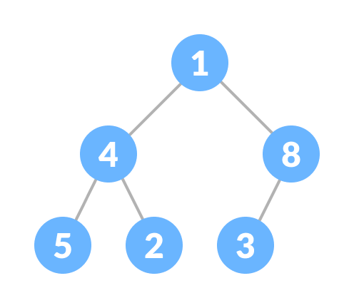

# JavaScript로 Heap | Priority Queue 구현하기

그래프 자료구조에서 엣지 간에 최단거리를 구하는 [다익스트라 알고리즘(Dijkstra Algorithm)](https://m.blog.naver.com/kks227/220796029558)을 사용해서 [문제](https://programmers.co.kr/learn/courses/30/lessons/12978?language=javascript) 해결을 하려고 했더니, 우선순위 큐에 대한 이해가 부족해서 이 글을 쓰게 되었다.

또 JavaScript 에는 구헌되어 있지 않은 자료구조인 우선순위 큐(Priority Queue) 를 직접 구현 하려고 봤더니 그 내면에는 힙(Heap) 자료구조가 숨어 있었다.

그래서 다시 바텀업(Bottom Up) 으로 힙을 구현하고 힙을 사용해 우선순위 큐를 구현 하려고 한다.

물론 다익스트라 알고리즘도 그렇고, 우선순위 큐도 그렇고 기본 배열로 작동하도록 구현 할 수 있지만 시간복잡도가 증가하기 때문에, 힙에 대해서 서술 해 본다.

> 힙 자료구조 시간 복잡도

```
- peek O(1)
- insert O(logn)
- remove O(logn)
```

# Heap

힙은 트리 기반의 자료구조이다. 규칙에 따라 크게 두 가지 힙을 나눌 수 있는데 **Max Heap** 과 **Min Heap** 이다.

> Max Heap: 부모 노드는 항상 자식 노드보다 크거나 같아야 한다.
> Min Heap: 부모 노드는 항상 자식 노드보다 값이 작아야 한다.

힙 전체를 통틀어서 이 규칙이 꼭 유지되어야 한다.
(이 글에서는 우선순위 큐와 연관을 짓기 위해서 Min Heap을 구현한다.)

일반적으로 힙 자료구조는 이진트리로 구현한다. 이진트리는 각각의 부모노드는 오로지 두개의 자식 노드(left, right) 만 가질 수 있다.추가적으로 완전한 이진트리의 구조를 사용하는데, 가장 아래 층을 제외하고는 모든 레벨이 완전히 채워져야 한다는 규칙이다.

따라서 앞서 서술한

1. 부모 노드는 항상 자식 노드보다 값이 작아야 한다.
2. 한 레벨이 모두 채워져야 다음 레벨로 트리가 늘어날 수 있다.

이 두 가지 규칙을 지키는 자료구조를 힙(Min Heap) 이라고 할 수 있다.

이 두 가지 규칙을 **항상** 따르는 힙은 이진트리 자료구조 임에도 불구하고 배열로 구현 할 수 있다.

```
왼쪽 자식 노드 인덱스 = 부모 노드 인덱스 * 2 + 1
오른쪽 자식 노드 인덱스 = 부모 노드 인덱스 * 2 + 2
부모 노드 인덱스 = (자식 노드 인덱스 - 1) / 2
```



위와 같은 트리를 아래 처럼 배열로 나타낼 수 있다.

```
index: 0 1 2 3 4 5
value: 1 4 8 5 2 3
```

위와 같은 규칙을 따르면 이진트리를 평평하게 배열에 담을 수 있다.

## 힙은 왜 필요할까?

힙을 코드로 구현하기 전에 힙이 왜 필요한지를 이해하면 구현하는데 도움이 된다. 힙은 주로 최소 | 최대 값을 O(1)의 시간복잡도로 얻어내기 위해서 사용된다. 배열이나 연결 리스트 같은 자료구조는 선형 탐색으로 인해서 최소 | 최대 값을 얻기 위해서 O(n) 이 걸린다. 이진탐색을 이용하면 O(logn) 까지도 시간 복잡도를 줄일 수 있다.

Min Heap 은 위의 두 가지 규칙 덕분에 항상 최상위 부모 노드에 최소값이 담겨있게 된다. 따라서 최상위 노드만 조회하면 바로 최소 값을 얻어낼 수 있기 때문에 O(1) 의 시간 복잡도를 가진다고 할 수 있다.

실제로는 어디에 쓰일까?
힙과 우선순위 큐를 같은 자료구조라고 볼 수 는 없지만, Min Heap 의 특성상(부모 노드는 항상 자식 노드보다 값이 작아야 한다) 우선순위 큐를 구현하는데 최적의 자료구조가 된다. 따라서 우선순위 큐의 사용처가 곧 힙의 사용처가 될 수 있다.

1. 우선순위 큐를 구현하는데 사용 할 수 있다.
2. 운영체제에서 우선순위 기반의 일들을 스케쥴링 하기 위해서 힙을 사용한다. (우선 순위가 높은 일을 바로 조회 할 수 있기 때문에)
3. 다익스트라 알고리즘(최단 거리 구하기 알고리즘) 에서 최소 비용을 기반으로 그래프를 탐색 할 때 사용된다.

## Min Heap 구현하기

### 1. 기본 골격 만들기

```js
class Heap {
  constructor() {
    this.heap = []
  }

  getLeftChildIndex = (parentIndex) => parentIndex * 2 + 1
  getRightChildIndex = (parentIndex) => parentIndex * 2 + 2
  getParentIndex = (childIndex) => Math.floor((childIndex - 1) / 2)

  peek = () => this.heap[0] // 항상 최상위 노드가 peek 가 된다.
}
```

### 2. insert

```js
class Heap {
  ...

  insert = (key, value) => { // 우선순위를 비교하기 위해서 key, value 로 받는다.
    const node = { key, value } // 객체로 node 를 만들고
    this.heap.push(node) // push 한다.
    this.heapifyUp() // 배열에 가장 끝에 넣고, 다시 min heap 의 형태를 갖추도록 한다.
  }
}
```

삽입의 메커니즘은 다음과 같다.

1. 먼저 배일의 끝에 넣는다.
2. Min Heap 의 형태를 갖추도록 조정한다.

사실 핵심은 2번에 있다. 최근에 삽입한 노드가 제 자리를 찾아 갈 수 있도록 아래로 부터 위로 끌어올려야 한다. 이 함수의 이름을 **heapifyUp** 이라고 하자.

```js
class Heap {
  ...

  heapifyUp = () => {
    let index = this.heap.length - 1 // 계속해서 변하는 index 값
    const lastInsertedNode = this.heap[index]

    // 루트노드가 되기 전까지
    while (index > 0) {
      const parentIndex = this.getParentIndex(index)

      // 부모 노드의 key 값이 마지막에 삽입된 노드의 키 값 보다 크다면
      // 부모의 자리를 계속해서 아래로 내린다.
      if (this.heap[parentIndex].key > lastInsertedNode.key) {
        this.heap[index] = this.heap[parentIndex]
        index = parentIndex
      } else break
    }

    // break 를 만나서 자신의 자리를 찾은 상황
    // 마지막에 찾아진 곳이 가장 나중에 들어온 노드가 들어갈 자리다.
    this.heap[index] = lastInsertedNode
  }
}
```

- 변수 index 는 계속해서 방금 들어온 노드의 위치를 탐색하기 위해서 변하는 값이다.
- lastInsertedNode: 최근에 삽입된 노드의 정보를 기억해 놓는다.
- index 가 루트노드가 되기 전까지 본인의 자리를 찾아가도록 while 문을 반복한다.
- 현재 탐색하고 있는 노드의 부모 노드가 방금 삽입된 노드보다 key 값이 크다면 (= 우선 순위가 낮다면) 탐색 중인 노드를 대체한다. 코드상 if 문에 해당한다.
- 탐색하는 노드를 부모 노드의 인덱스로 바꾸고 다시 반복문을 반복한다.
- 부모노드의 key 가 방금 삽입된 노드와 키 값이 작거나 같다면 (= 우선순위가 높다면) 자신의 위치를 찾은 것 이므로 break 로 while 문을 빠져 나간다.
- 최종 index 가 방금 삽입 된 노드의 위치가 된다.

## 3. remove

```js
class Heap {
  ...

    remove = () => {
    const count = this.heap.length
    const rootNode = this.heap[0]

    if (count <= 0) return undefined
    if (count === 1) this.heap = []
    else {
      this.heap[0] = this.heap.pop() // 끝에 있는 노드를 부모로 만들고
      this.heapifyDown() // 다시 min heap 의 형태를 갖추도록 한다.
    }

    return rootNode
  }
}
```

최소값을 꺼내는 삭제의 메커니즘은 다음과 같다.

1. 최상위 노드를 꺼낸다.
2. 이 때, 배열안에 요소가 2개 이상 남아 있다면, 끝에 있는 노드를 최상위 부모로 만든다.
3. Min Heap 의 형태를 갖추도록 조정한다.

remove 메소드의 핵심도 3번에 있다. 최근에 자리가 최상위 부모로 바뀐 노드의 올바른 위치를 찾아 내기 위한 작업이 필요하다. 위에서 부터 아래로 끌어 내려야 하기 때문에 함수의 이름을 **heapifyDown** 이라고 하자.

```js
class Heap {
  ...

  // 변경된 루트노드가 제 자리를 찾아가도록 하는 메소드
  heapifyDown = () => {
    let index = 0
    const count = this.heap.length
    const rootNode = this.heap[index]

    // 계속해서 left child 가 있을 때 까지 검사한다.
    while (this.getLeftChildIndex(index) < count) {
      const leftChildIndex = this.getLeftChildIndex(index)
      const rightChildIndex = this.getRightChildIndex(index)

      // 왼쪽, 오른쪽 중에 더 작은 노드를 찾는다
      // rightChild 가 있다면 key의 값을 비교해서 더 작은 값을 찾는다.
      // 없다면 leftChild 가 더 작은 값을 가지는 인덱스가 된다.
      const smallerChildIndex =
        rightChildIndex < count && this.heap[rightChildIndex].key < this.heap[leftChildIndex].key
          ? rightChildIndex
          : leftChildIndex

      // 자식 노드의 키 값이 루트노드보다 작다면 위로 끌어올린다.
      if (this.heap[smallerChildIndex].key <= rootNode.key) {
        this.heap[index] = this.heap[smallerChildIndex]
        index = smallerChildIndex
      } else break
    }

    this.heap[index] = rootNode
  }
}
```

- 자식 노드가 있을 때 까지 반복문으로 검사를 진행한다.
- 자식 노드가 두개이기 때문에 오른쪽 자식노드가 존재 하는지의 유무와 왼쪽 오른쪽 노드 중에 어느것이 더 작은 값을 가지고 있는지 검사해서 smallerChildIndex 에 담는다.
- 자식 노드의 key 값이 최상위 루트 노드에 들어간 key 값 보다 작다면 위로 끌어 올린다. (현재 탐색 하고 있는 노드의 인덱스로 우선 순위를 높인다) 코드에서 if 부분에 해당한다.
- 자식 노드의 인덱스로 검색하는 인덱스의 노드를 변경시키고 while 문을 반복한다.
- 자식 노드의 key 가 최상위 루트 노드의 key 보다 크다면 자신의 위치를 찾은 것. break 로 while 문을 빠져나간다.
- 최종적인 index 가 최상위 부모의 위치에 들어간 노드가 있어야 할 자리가 된다.

## Priority Queue 구현하기

```js
class PriorityQueue extends Heap {
  constructor() {
    super()
  }

  enqueue = (priority, value) => this.insert(priority, value)
  dequeue = () => this.remove()
  isEmpty = () => this.heap.length <= 0
}
```

우선순위 큐는 위와 같이 이미 구현한 Min Heap 을 상속해서 세 가지 메소드를 구현한다.

- enqueue: Min Heap 에 넣기
- dequeue: Min Heap 에서 삭제하기 (= 우선순위가 가장 높은 노드 꺼내기)
- isEmpty: heap 이 비었는지 체크하기

## References

- [[Github] Google Closure Library](https://github.com/google/closure-library/blob/master/closure/goog/structs/priorityqueue.js)
- [[Medium] Implementing a Complete Binary heap in JavaScript: The Priorty Queue](https://codeburst.io/implementing-a-complete-binary-heap-in-javascript-the-priority-queue-7d85bd256ecf)
- [[Medium] Implementing Heaps in JavaScript](https://blog.bitsrc.io/implementing-heaps-in-javascript-c3fbf1cb2e65)
- [[Youtube] Hacker Rank Priority Queue](https://www.youtube.com/watch?v=t0Cq6tVNRBA)

이 글에 실린 코드의 최종본은 다음 [github 레포지토리](https://github.com/Jun4928/crashing_algorithms/tree/feature/jun/jun/data_structures) 에서 확인 할 수 있습니다.
