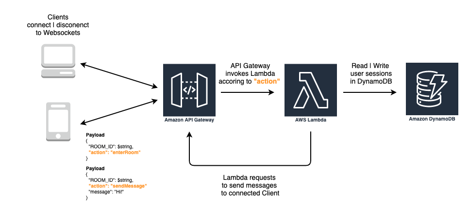

# TypeSript | AWS Lambda 에러 핸들러

## 상황

현재 진행하고 있는 프로젝트에서 실시간 위치와 채팅을 위해 웹 소켓 서버가 필요했다. 그리고 나는 확장 가능한 웹 소켓 서버를 구현하기 원했다. 여느 서버 배포처럼 크게 세 가지 군의 옵션이 있었다.

1. AWS EC2 (IaaS: Infrastructure as a Service)
2. AWS Beanstalk 또는 Heroku (PaaS: Platform as a Service)
3. AWS Lambda (FaaS: Function as a Service)

1번은 불어나는 소켓 로드를 감당 하려면 인프라(컴퓨팅 자원관리와 운영)에 많은 에너지와 리소스가 투업되어야 한다. 이번 프로젝트에서 혼자 백엔드를 맡았기 때문에 선택군에서 가장 빠르게 제외했다.

2번은 처음에 굉장히 매력적인 선택지였다. 작성한 웹소켓 어플리케이션을 아주 쉽게 배포할 수 있었다. 명령어 몇줄이면 앱이 바로 배포되는 경험을 하면서 이렇게 해도 되는 것인가(?) 하는 의문이 들 정도였다. PaaS 는 인프라를 직접 관리 할 필요가 없다. 로드가 늘어남에 따라 명령어 몇줄이면 자동으로 자원이 늘어나고 관리가 된다는 점에서 매력적이었다. 하지만, 그만큼 비용이 비싸다는 단점이 있고, 프로젝트 경험을 쌓기에 적절치 않은 옵션이라고 생각했다.

3번은 노드를 주력으로 사용하는 나에게 가장 매력적인 선택지였다. 하지만, 소켓 통신은 Http 통신과 다르게 클라이언트간에 연결을 **유지** 시켜야 한다. 검색끝에 AWS API Gateway 에 Websocket API 가 2018년 말에 출시되었다는 것을 발견했다. 유튜브에 각종 영상과 구글링을 거듭한 끝에 지금 내 상황에 적합하다고 판단되어서 개발을 진행했다.

AWS API Gateway 는 이름 그대로 클라이언트의 요청이 백엔드 API에 닿기 위한 관문같은 역할을 하는데 본래 HTTP 기반 RESTful API 만 지원했었다. 새롭게 지원된 Websocket API 는 연결 상태를 유지하고, 연결된 클라이언트끼리 메시지를 주고 받을 수 있도록 API를 지원한다. 작동 방식은 아래와 같다.

1. Client 에서 API Gateway 에 소켓을 통해 Payload 를 보낸다.
2. Payload 의 **action** 키 값에 따라 라우팅이 된다.
3. 라우팅에 맞는 Lambda 핸들러가 트리거 된다.



즉, 각각의 액션에 맞는 Lambda 핸들러만 잘 구현하면 소켓 서비스를 구현할 수 있다.
Lambda 핸들러는 그저 원하는 액션을 처리하는 함수다.

AWS CTO 인 Werner Vogels 가 re:Invent 에서 **AWS 에서 기대하고 있는 미래가 어떤 모습일까?** 에 대한 질문에 다음과 같이 말했다.

> 당신이 쓰는 모든 코드가 비지니스 로직이다.


이번에 소켓 통신을 위한 백엔드 앱을 구현하며 이 말을 실감하게 되었다.

## 왜 에러 핸들러가 필요한가?

서론이 길었는데 이 글의 목적은 Node.js(TypeScript) 로 Lambda 환경에서 비지니스 로직을 개발할 때 필요한 에러 핸들링을 어떻게 할 것인가에 대한 글이다.
사실 Lambda 환경이라고 해도 노드로 에러 핸들링을 하는 방법은 동일하다. _try/catch_ 문을 사용하면 된다.

채팅 앱을 구현한다고 가정하고 유저가 채팅 방에 입장했을 때 처리해야 할 로직을 구현하면 다음과 같다.

**enterRoom.ts**

```ts
export const handler = async (event: APIGatewayEvent) => {
  // 유저의 고유한 connectionId 를 event 객체에서 얻어낸다.
  const { connectionId } = event.requestContext
  // Websocket 을 통해 보내진 payload 는 event 객체의 body 에 담겨있다. 고유한 방 ID를 얻어낸다.
  const { ROOM_ID } = JSON.parse(event.body as string)

  // AWS DynamoDB 에 채팅방 ID에 연결된 유저의 정보를 남긴다. (연결 세션을 관리하기 위해서)
  // 이미 작성된 AWS Dynamo Client 를 추상화한 Dyanmo 클래스의 write 메소드를 호출한다.
  await Dynamo.write({
    ROOM_ID,
    connectionId,
  })

  // 200 응답을 보내주지 않으면 에러 상황으로 간주되어 웹 소켓 연결이 되지 않는다.
  // 이 응답은 클라이언트에게 가는 것이 아니라 Lambda 를 호출한 AWS API Gateway 에게 가는 것이다.
  return {
    statusCode: 200,
    body: { message: 'enterRoom', connectionId },
  }
}
```

> 이 글은 채팅서버를 구현하기 위한 글이 아니기 때문에 코드에 대한 설명은 주석으로 간단하게 했습니다.
> 채팅 서버 구현 코드는 다음 [Github 레포지토리에](https://github.com/rabbit-turtle/backend-websockets)서 확인 할 수 있습니다.

상단의 코드는 안전하지 않다. 왜냐하면 항상 이 코드가 100% 성공한다고 보장할 수 없기 때문이다. TypeScript 이기 때문에 런타임 시에 발생 될 에러를 어느정도 잡아 낼 수는 있다.
하지만, 중간에 AWS Dynamo DB(NoSQL 데이터베이스)에 데이터를 쓰는 코드는 우리가 핸들링 할 수 없는 에러를 낼 수 있다. 왜냐하면, 네트워크를 거쳐야 하고 Database 에 데이터를 저장하는 일을 하는 코드이기 때문에 네트워크 커넥션 에러(대표적으로 타임아웃 에러)나 데이터베이스의 컨디션에 따라 **예측할 수 없는** 에러를 낼 수 있기 때문이다. 위에서 작성한 코드는 이러한 경우를 잡아낼 수 없을 뿐더러 에러가 발생 할 수 있는 상황이 있음에도 항상 statusCode 200 을 리턴하고 있기 때문에 나쁜코드라고 할 수 있다.

따라서 에러 핸들링을 해야한다.
어떻게 할 것인가? 비동기 로직에 대한 에러 핸들링은 _try/catch_ 를 사용하면 된다.

**enterRoom.ts**

```ts
export const handler = async (event: APIGatewayEvent) => {
  try {
    const { connectionId } = event.requestContext
    const { ROOM_ID } = JSON.parse(event.body as string)

    await Dynamo.write({
      ROOM_ID,
      connectionId,
    })

    return {
      statusCode: 200,
      body: { message: 'enterRoom', connectionId },
    }
  } catch (e) {
    console.err(e)
    return {
      statusCode: 400,
      body: 'error occurred',
    }
  }
}
```

위에서 언급한 대로, 로직에서 발생 할 수 있는 예기치 못한 에러를 catch 문에서 잡아서 cloudWatch 에서 에러 로그를 확인 할 수 있도록 로그를 출력 해 주고, 요청이 제대로 처리되지 않았기 때문에 API Gateway 에게 400번대 응답 메세지를 보낸다.

## 에러 핸들러 구현하기

_try/catch_ 로 에러를 핸들링하는 위의 코드는 에러를 핸들링하고 있기 때문에 첫번째 작성했던 코드 보다는 좋은 코드라고 할 수 있다. 그럼 이번에는 프로젝트를 구성하는 코드의 관점에서 다시 생각해보자.

채팅앱을 구현 할 때, 위에서 작성한 방에 입장했을 때 트리거 되는 **enterRoom** Lambda 핸들러 뿐만 아니라, 메세지 보내기, 방에서 나가기 등.. 의 여러가지 액션에 대해서도 핸들링하는 Lambda 함수들을 작성해야 한다고 치자. 그렇다면, 모든 핸들러에서 아래와 같이 에러 핸들링을 위한 _try/catch_ 코드가 반복된다.

### try/catch 문이 계속해서 반복되는 Lambda 핸들러(=서비스 로직)

```ts
export const handler = async (event: APIGatewayEvent) => {
  try {
    // 메세지 보내기 로직 | 방에서 나가기 로직 | etc..

    return {
      statusCode: 200,
      body: { message: 'enterRoom', connectionId },
    }
  } catch (e) {
    console.err(e)
    return {
      statusCode: 400,
      body: 'error occurred',
    }
  }
}
```

**서비스의 규모가 커져서 핸들러가 100개, 1000개가 된다면 위와 같은 _try/catch_ 구문이 계속해서 필요하고 반복되어야 한다.**
이렇게 반복되는 에러 핸들링 코드를 모듈화 하기 위해서 Lambda 환경에서 다양한 목적으로 확장 시킬 수 있는 고차 함수(함수를 받아서 함수를 리턴하는 함수) **handlerWrapper**구현했다.

### common/handlerWrapper.ts

```ts
import {
  APIGatewayProxyHandler,
  APIGatewayEvent,
  Context,
  Callback,
  APIGatewayProxyResult,
} from 'aws-lambda'

export type CustomLambdaHandler<TResult = CustomResponse> = (
  event: APIGatewayEvent
) => Promise<TResult>

export const handlerWrapper = (handler: CustomLambdaHandler): APIGatewayProxyHandler => async (
  event: APIGatewayEvent,
  context: Context
) => {
  try {
    const { statusCode, body } = await handler(event)
    return { statusCode, body }
  } catch (err) {
    console.log(err)
    return { statusCode: 400, body: err }
  }
}
```

이 함수의 타입을 간단히 하면 다음과 같다.

```ts
export const handlerWrapper = (handler: CustomHandler): APIGatewayProxyHandler
```

- 서비스 로직이 담긴 비동기(async) Lambda 핸들러를 인자로 받아서, APIGatewayProxyHandler 를 리턴하는 함수다.
- handlerWrapper 가 리턴하고 값은 화살표 함수로 표현된 함수다. 이 화살표 함수가 Lambda 가 트리거 되었을 때 가장 먼저 마주하게 되는 APIGatewayProxyHandler 가 된다.
- 본래 서비스 로직이 담긴 비동기 Lambda 핸들러는 타입이 APIGatewayProxyHandler 로써 두가지 인자를 받도록 **약속**되어 있다. (동기적인 Lambda Handler는 마지막에 callback 함수를 인자로 받는다)

> event: APIGatewayEvent,
> context: Context,

- arror function 의 코드를 들여다 보면, 본래 APIGatewayProxyHandler 가 인자로 받는 두 가지 파라미터를 인자로 받고
- 인자로 받은 handler 를 실행시키고 리턴되는 statusCode 와 body 를 구조분해할당 한 후 리턴한다.
- 에러가 발생하면 에러 로그를 찍고, 400대 에러를 응답한다.

이 함수만 봐서는 감이 오지 않으니 실제로 위에서 작성한 enterRoom 에 적용 해 보자.

### handlerWrapper가 적용 된 enterRoom.ts

```ts
import { handlerWrapper } from './common/handlerWrapper'

export const handler = handlerWrapper(async (event: APIGatewayEvent) => {
  const { connectionId } = event.requestContext
  const { ROOM_ID } = JSON.parse(event.body as string)

  await Dynamo.write({
    ROOM_ID,
    connectionId,
  })

  return {
    statusCode: 200,
    body: { message: 'enterRoom', connectionId },
  }
})
```

- 처음에 작성했던 **enterRoom.ts** 에서 _try/catch_ 문은 빠지고 **handlerWrapper**로 실제 서비스 로직이 담긴 Lambda 핸들러를 감싸고 있다.
- 이제 이 서비스 로직에서 에러가 발생해도 괜찮다. 왜냐하면 이 함수를 감싸고 있는 **handlerWrapper** 에서 에러를 _try/catch_ 하기 때문이다.

### CustomLambdaHandler type

```ts
export type CustomResponse = {
  statusCode: number
  body: string | object
}

export type CustomLambdaHandler<TResult = CustomResponse> = (
  event: APIGatewayEvent
) => Promise<TResult>
```

다시 **handlerWrapper** 의 구현된 코드로 맥락을 옮겨서 설명하면, 작성하는 모든 Lambda 핸들러에 대한 타입을 지정할 수 있다.

- CustomLambdaHandler 는 실제 서비스 로직이 담긴 Lambda 핸들러다.
- 이 Lambda 핸들러는 event 객체를 인자로 받고, Promise 를 리턴하는데 Promise 의 타입은 이 함수가 리턴하는 CustomResponse(statusCode 와 body 를 담고있는 객체) 다.
- 앞으로 작성할 모든 LambdaHandler 는 이 타입을 따르기 때문에 인자와 리턴 값을 미리 타입으로 지정 해 둔 것이다. => 이를 통해서 IDE의 타입지원과 자동완성을 얻을 수 있다.
- **enterRoom** 핸들러가 곧 CustomLambdaHandler 의 타입을 따르는 함수다.

## Wrap Up

- 결국 Lambda 함수가 트리거 되면 가장 먼저 만나는 함수가 **handlerWrapper** 가 되는 셈이다.
- **hadlerWrapper** 는 서비스 로직이 담긴 CustomLambdaHandler를 인자로 받아서 Lambda 가 트리거 되었을 때 CustomLambdaHandler를 실행시키는 함수다.
- 이 함수는 수 없이 많이 작성하게 될 Lambda 핸들러의 에러 핸들링을 모듈화 하기 위해서 존재하는 고차함수다.

이 고차함수가 적용된 프로젝트는 아래 링크에서 확인 할 수 있습니다.

> [토끼와 거북이 WebSocket 서버코드 구경하러 가기](https://github.com/rabbit-turtle/backend-websockets)
